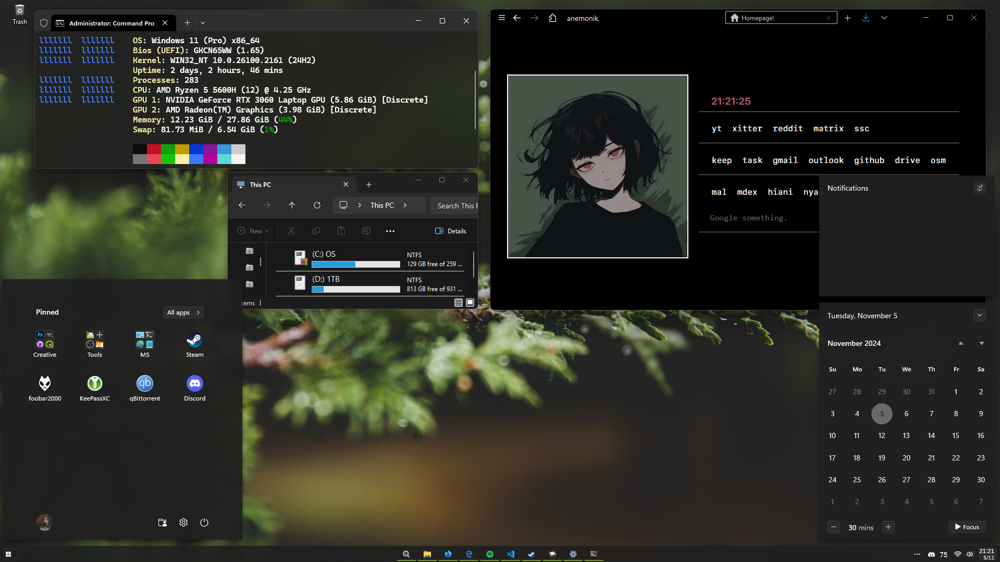

# Forest - Windhawk-based theme for Windows 11
  

So what is it? This is repositorium with my configuration files for Windhawk plugins to make Windows 11 more appealing and minimal with nature accent.
This project is not finished yet, but it functions well and it's close to finish. So you can wait for updates.

## Installation
1. Download and install Windhawk
2. Install these required plugins:
    - <a href="https://windhawk.net/mods/taskbar-start-button-position">Start button always on the left </a>
    - <a href="https://windhawk.net/mods/icon-resource-redirect">Resource Redirect</a>
        - with <a href="https://github.com/niivu/resource-redirect-icon-themes/blob/main/Resource%20Redirect%20themes/arc-neutral%20grey.zip">Arc-Neutral Grey</a> icon pack
    - <a href="https://windhawk.net/mods/taskbar-clock-customization">Taskbar Clock Customization</a>
    - <a href="https://windhawk.net/mods/taskbar-icon-size">Taskbar height and icon size</a>
    - <a href="https://windhawk.net/mods/windows-11-start-menu-styler">Windows 11 Start Menu Styler</a>
    - <a href="https://windhawk.net/mods/windows-11-notification-center-styler">Windows 11 Notification Styler</a>
    - <a href="https://windhawk.net/mods/windows-11-taskbar-styler">Windows 11 Taskbar Styler</a> 
        - You can choose between two configs:
            - Windows 11 Taskbar Styler (start button on the left side and app indicators on the middle like in the screenshot)
            - Windows 11 Taskbar Styler_appsonleft (start button and app indicators are on the left side)
3. Load configuration files from config folder into Windhawk plugins settings 
    - (Advanced tab > Mod settings)
4. In Windows 11 Taskbar Settings set up the location of start button icon file:
    - search for "Taskbar.ExperienceToggleButton#LaunchListButton[AutomationProperties.AutomationId=StartButton] > Taskbar.TaskListButtonPanel > Border#BackgroundElement" line, then change the ImageSource value.
    - default location is "C:\icons\eee.png"
5. In Resource Redirect set up the location of icon pack folder (arc-neutral grey folder)

And that's it! You just made Windows 11 less cluttred :)

## Extras
Soon.